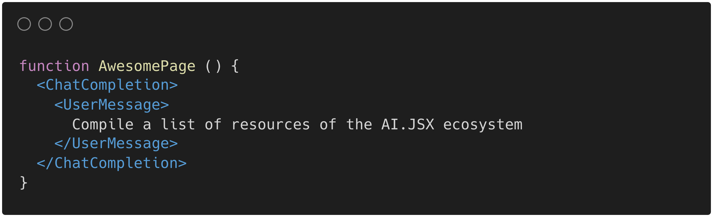

# awesome-ai-jsx

## AI.JSX main repo
- [fixie-ai/ai-jsx](https://github.com/fixie-ai/ai-jsx)

## Utilities
- [FreakDev/ai-jsx-agents](https://github.com/FreakDev/ai-jsx-agents)
- [FreakDev/ai-jsx-model-providers](https://github.com/FreakDev/ai-jsx-model-providers)

## Frameworks

- [microchipgnu/micro-agi](https://github.com/microchipgnu/micro-agi): React-compatible cross-platform framework for orchestrating autonomous AI agents and teams

## Wallet
- [microchipgnu/near-autonomous-wallet](https://github.com/microchipgnu/near-autonomous-wallet): NEAR Protocol wallet powered by autonomous agents

## Videos
- [Large Language Models and The End of Programming - CS50 Tech Talk with Dr. Matt Welsh](https://www.youtube.com/watch?v=JhCl-GeT4jw)
- [Building Reactive AI Apps: Matt Welsh](https://www.youtube.com/watch?v=qpPgCA664xw)
